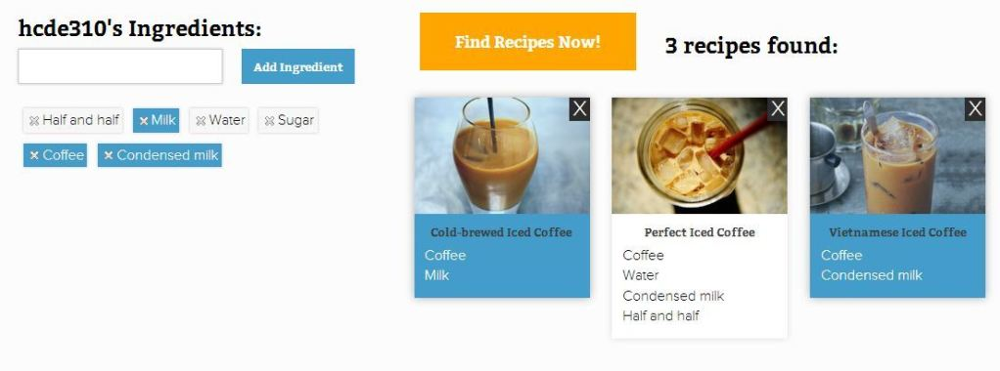

## Project Description

A fun reverse recipe search application with accounts and many other features. Demonstrates skill in:

- Python
- PHP
- MySQL
- JavaScript
- CSS

Features include a masonry layout, ingredient highlighting, intelligent autocomplete, responsive design, and more. Upcoming releases will include additional search algorithms, a gentle redesign of the front end, and an expanded database.

