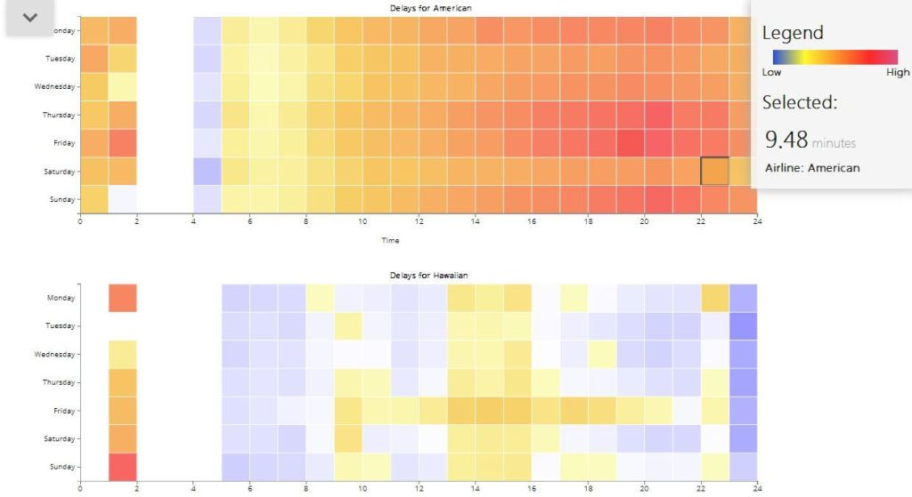

# Case Study

This is a class project in Information Visualization. I collected data, put it in a relational database, retrieved and sent it with an API, and displayed it on a page with D3.js. It was a great exercise in full-stack web development and info viz both, and I hope to continue in this area.

# Skills Used

- D3.js
- LESS
- MySQL
- jQuery
- SVG Graphics

