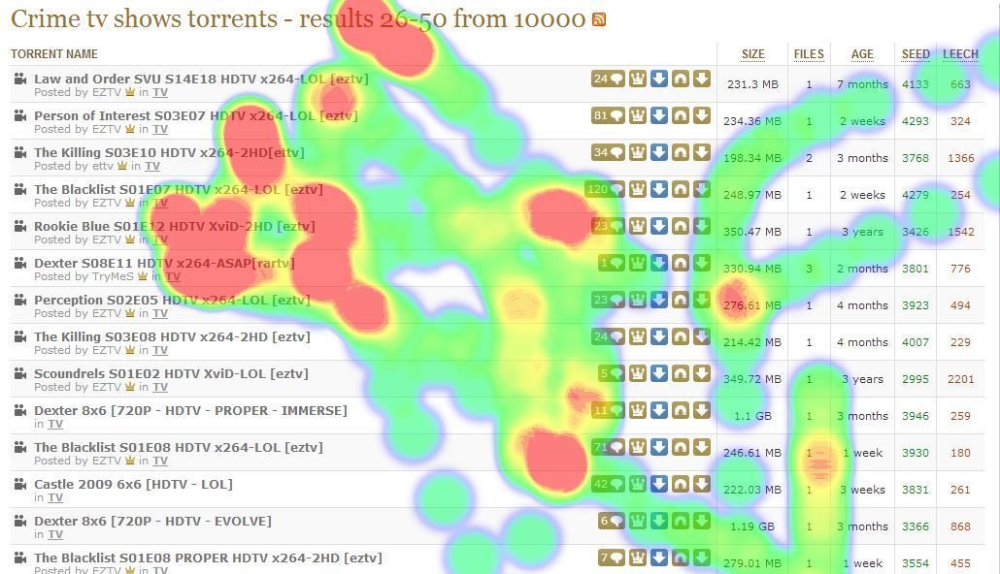

&#xA0;

## Project Description

A Chrome extension to take metrics in order to automate some data collection aspects of usability testing. Tracks clicks, keypresses, mouse movements, and more, stores them in the browser&#x2019;s local storage, and then generates relevant reports.

Built with JavaScript, jQuery, and LESS