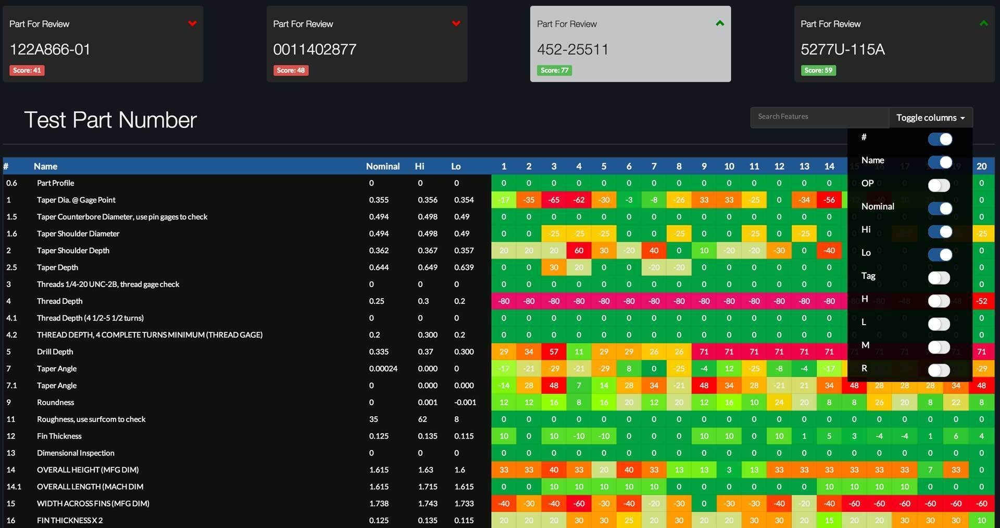

## Case Study

I built an industry-leading application for quality management. It implements big data visualization, data visibility, and other ideas that are essential in manufacturing. The table showcases several nice features I built in AngularJS, including sorting, filtering, and column visibility toggles.

## Skills Used

- JavaScript
- AngularJS
- CSS
- .NET
- Data Visualization

