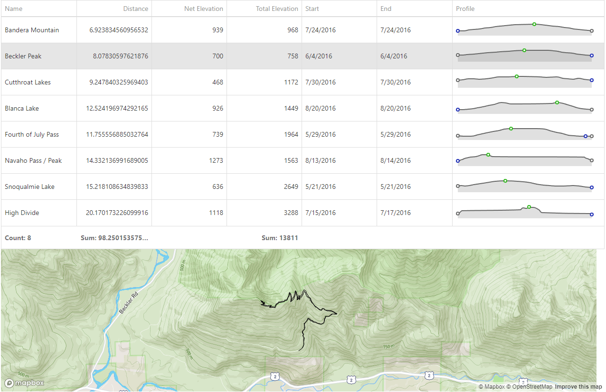

## Case Study

I&#x2019;ve been tracking most of my hiking for the last few years in an app called Gaia GPS. I wanted to see some aggregate statistics about my hiking after one summer, so I built a small application that allows users to upload a set of GPX files. From the files, the user can see a variety of statistics, aggregates, and view the tracks on a map.

## Skills Used

- Angular
- MapBox
- Turf.js
- DevExtreme

