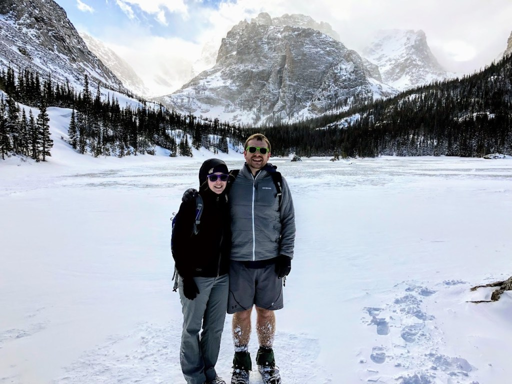

## Kyle Karpack

#### Front-End / Full-Stack Developer

Thanks for checking out my site. I&#x2019;m a front-end developer based out of Seattle. I love building things for the web, but outside work, I enjoy hiking, soccer, cooking, reading, and spending time with my family.

### My Skills

- HTML + CSS
- SASS + LESS
- JavaScript + TypeScript
- Angular + AngularJS
- NodeJS
- npm + Yarn
- MSSQL & MySQL
- Microsoft Azure
- PHP
- MongoDB, ElasticSearch (working knowledge)
- C# (working knowledge)
- Amazon Web Services (working knowledge)

- [Facebook](https://facebook.com/kylekarpack)
- [LinkedIn](https://www.linkedin.com/in/kylekarpack)
- [GitHub](https://github.com/kylekarpack)
- [Email](mailto:kylekarpack@gmail.com)